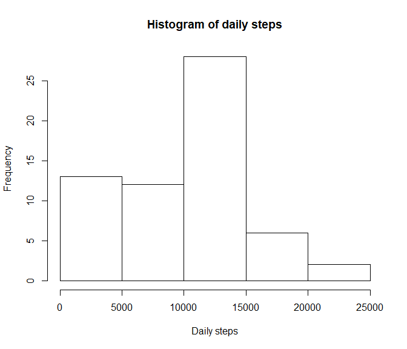
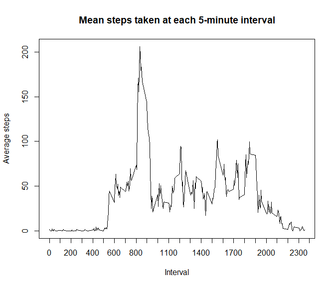
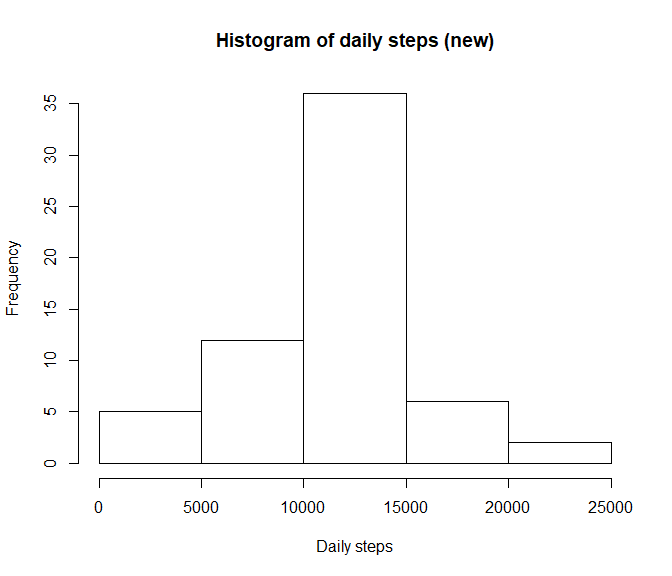
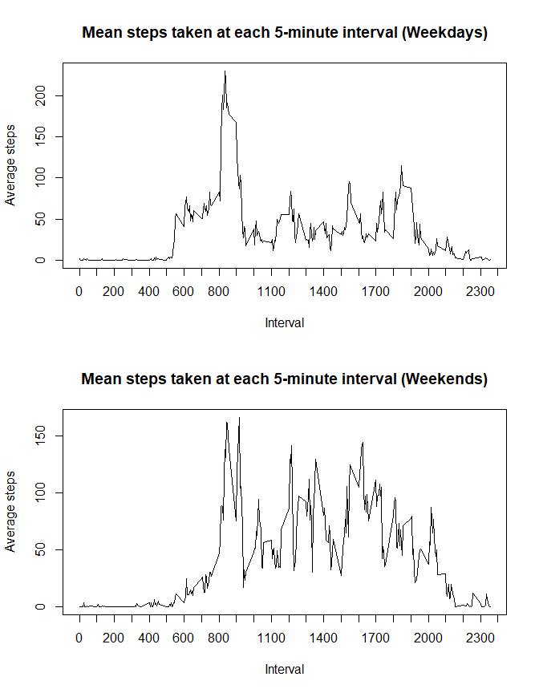

## Introduction
This analysis takes a look at the data from a personal activity monitoring device. This device collects data at 5 minute intervals throughout the day. The data consists of two months of data from an anonymous individual collected during the months of October and November, 2012 and includes the number of steps taken in 5 minute intervals each day.  
The study explores areas such as the distribution of total daily steps, average daily activity pattern, comparison across weekdays and weekends, and whether imputing missing values has an impact on the results.
  
  
## Loading and preprocessing the data
The below code reads in the data from a CSV file stored in the same directory, and transforms the dataset by creating a date.time column and daytype column, which contain the full date and time and indicate whether the day is weekday or weekend, respectively.

```r
## Install and load necessary packages
if(!("dplyr" %in% row.names(installed.packages())))
        install.packages("dplyr")

library(dplyr)
```

```
## 
## Attaching package: 'dplyr'
```

```
## The following objects are masked from 'package:stats':
## 
##     filter, lag
```

```
## The following objects are masked from 'package:base':
## 
##     intersect, setdiff, setequal, union
```

```r
## Loading data
fitdata <- read.csv("activity.csv")

## Transforming data/adding new columns
### Date & time column
hour <- fitdata$interval %/% 100
min <- fitdata$interval %% 100
fitdata <- mutate(fitdata, date.time=as.POSIXct(strptime(paste(date, hour, min), "%Y-%m-%d %H %M")))

### Day type column
days <- character(17568)
for(i in 1:17568){
        day <- weekdays(as.Date(fitdata$date[i]))
        if(day %in% c("Saturday", "Sunday"))
                days[i] <- "weekend"
        else
                days[i] <- "weekday"
}
fitdata <- mutate(fitdata, daytype=as.factor(days))
```
  
  
## What is the mean total number of steps taken per day?
The below code calculates the total number of steps taken each day and examines its distribution by creating a histogram. It also calculates the mean and median of the subject's daily step count. Missing values are ignored.

```r
dailysteps <- tapply(fitdata$steps, fitdata$date, sum, na.rm=TRUE)

hist(dailysteps, main="Histogram of daily steps", xlab="Daily steps")
```

<!-- -->

```r
m1 <- mean(dailysteps)
m2 <- median(dailysteps)
```

The mean number of daily steps is 9354.2295082 and median value is 10395
  
  
## What is the average daily activity pattern?
The below code examines the average daily activity pattern by creating a time series plot of the average number of steps taken per 5 minute interval, across all days. It then finds out which 5-minute interval is the most active, that is, has the highest average step count. Missing values are ignored.

```r
intervalavg <- tapply(fitdata$steps, fitdata$interval, mean, na.rm=TRUE)

plot(unique(fitdata$interval), intervalavg, type = "l", lab=c(23, 5, 5), xlab="Interval",
     ylab="Average steps", main="Mean steps taken at each 5-minute interval")
```

<!-- -->

```r
maxint <- names(which(intervalavg==max(intervalavg)))
```

The most active interval (based on average step count) is 835
  
  
## Imputing missing values

```r
totalNA <- sum(is.na(fitdata$steps))
```
Of 17568 rows in the data set, 2304 rows contain missing values for the step count. To counter this, the code below imputes the missing values by replacing them with the mean value for that interval, across all days, and stores the new dataset separately.

```r
newsteps <- integer(17568)
for(i in 1:17568) {
        if(is.na(fitdata$steps[i])){
                j <- i %% 288
                if(j==0) { j <- 288 }
                newsteps[i] <- intervalavg[j]
        }
        else
                newsteps[i] <- fitdata$steps[i]
}
newfitdata <- mutate(fitdata, imputedsteps=newsteps)
```

Next, the code uses the new dataset to calculate the total number of steps taken each day and creates a histogram of the new values. It also calculates the new mean and median of the subject's daily step count.

```r
newdailysteps <- tapply(newfitdata$imputedsteps, fitdata$date, sum)

hist(newdailysteps, main="Histogram of daily steps (new)", xlab="Daily steps")
```

<!-- -->

```r
m3 <- mean(newdailysteps)
m4 <- median(newdailysteps)
```
The new mean number of daily steps is 1.0766189\times 10^{4} and new median value is 1.0766189\times 10^{4}. It can be seen that imputing the missing values does make a difference, as the new mean and median values are higher than the previous values. Also, they are equal, and the distribution of total daily steps becomes slightly more symmetrical.
  
  
## Are there differences in activity patterns between weekdays and weekends?
The below code examines the difference in activity patterns between weekdays and weekends. It compares two time series plots, of the 5-minute interval and the average number of steps taken, averaged across all weekday days and weekend days (as indicated by the daytype column).

```r
par( mfrow= c( 2, 1 ) )
weekdaydata <- filter(newfitdata, daytype=="weekday")
weekenddata <- filter(newfitdata, daytype=="weekend")

## Weekday plot in panel 1
intervalavg <- tapply(weekdaydata$imputedsteps, weekdaydata$interval, mean, na.rm=TRUE)
plot(unique(weekdaydata$interval), intervalavg, type = "l", lab=c(23, 5, 5), xlab="Interval",
     ylab="Average steps", main="Mean steps taken at each 5-minute interval (Weekdays)")

## Weekend plot in panel 2
intervalavg <- tapply(weekenddata$imputedsteps, weekenddata$interval, mean, na.rm=TRUE)
plot(unique(weekenddata$interval), intervalavg, type = "l", lab=c(23, 5, 5), xlab="Interval",
     ylab="Average steps", main="Mean steps taken at each 5-minute interval (Weekends)")
```

<!-- -->
  
  
## Conclusion
This analysis explored various patterns in an individual's activity patterns, and also examined the difference made by imputing missing values. Some observations:  
* The subject most frequently walks between 10000 - 15000 steps daily.  
* Daily activity peaks between 8-9 every morning.  
* Imputing missing values does have an impact on results, and the strategy used (average step count for that interval) makes the distribution of total daily steps slightly more symmetrical.  
* The subject appears more active during the weekends, when compared to the weekdays.  
